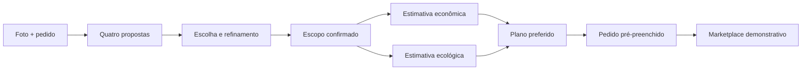

# ObrIA

> **ObrIA transforma uma foto e a intenção de uma reforma em um plano preliminar comparável, pronto para ser levado a profissionais, sem fingir medição técnica nem contratação.**

ObrIA é uma experiência guiada para quem está planejando reformar um ambiente. A pessoa visualiza alternativas, escolhe um caminho, confirma o escopo, compara duas formas de estimar o trabalho e prepara um pedido estruturado para avaliação profissional.

> **Limites da demonstração:** este repositório contém uma aplicação local para apresentar a jornada P0. O marketplace, os perfis, as propostas e os valores são fictícios e locais; nenhuma integração externa ou contratação real é pressuposta.

## Estado atual

O snapshot atual contém uma aplicação Next.js executável em `src/`, seu manifesto `package.json`, `pnpm-lock.yaml`, tipos compartilhados, cálculo determinístico de estimativas, dados demonstrativos do marketplace e testes Vitest. A jornada visual de Artur permanece como a interface principal: intake, quatro opções, refinamento, escopo, estimativas e handoff para a prévia de publicação.

O fluxo de publicação usa `localStorage` no navegador para transportar um `MarketplaceProjectPost` validado por Zod entre a jornada e `/projeto/[id]/publicar`. O feed em `/marketplace` e a fixture `demo-project-sala-natural` são demonstrativos e não representam busca, matching, contato ou disponibilidade reais.

Não há evidência neste repositório de chamadas funcionais para OpenAI, persistência Supabase, deploy Vercel ou integração com fornecedores externos. Esses serviços permanecem fora do escopo comprovado desta versão.

As regras de produto continuam no [PRD](./PRD.md), o plano de integração está em [PLANO_EXECUCAO_EQUIPE.md](./PLANO_EXECUCAO_EQUIPE.md) e os critérios de evidência estão em [QUALITY_GATES.md](./QUALITY_GATES.md).

## A jornada do produto

A história é uma só, do primeiro registro visual até um pedido que um profissional pode avaliar:



### 1. Registrar o ambiente

A pessoa envia uma foto de um cômodo e informa cidade e UF, tipo de ambiente, área aproximada, nível de acabamento e o que deseja mudar. A foto serve como referência visual. O produto não mede o cômodo a partir de pixels.

### 2. Explorar quatro caminhos

A aplicação gera quatro propostas visuais para o mesmo ambiente. A pessoa compara as opções e escolhe uma. O objetivo é dar controle sobre a direção da reforma, não apresentar uma decisão automática.

### 3. Refinar uma escolha

A proposta escolhida vira a origem de um ajuste focado, como preservar o piso, mudar a iluminação ou reduzir o número de alterações. O PRD prevê uma rodada visível de refinamento no P0.

### 4. Confirmar o escopo

O sistema faz no máximo três perguntas objetivas quando uma resposta muda a estimativa. A pessoa revisa categorias, quantidades, unidades e premissas antes de confirmar o escopo.

### 5. Comparar duas estimativas preliminares

A mesma base de escopo alimenta dois perfis:

- **Mais econômica:** prioriza o menor investimento inicial razoável.
- **Mais ecológica:** aplica alternativas catalogadas que podem favorecer reuso, menor descarte, eficiência ou materiais de menor impacto potencial.

A comparação deve mostrar faixa de valor, diferenças por item, premissas e ressalvas. A alternativa ecológica não é uma obrigação moral nem recebe um índice ambiental inventado.

### 6. Preparar o pedido para profissionais

O pedido é pré-preenchido com a imagem escolhida, cidade e UF, área aproximada, escopo, faixa da estimativa, preferência de plano e prazo. A pessoa revisa o conteúdo e autoriza a exibição no protótipo.

A etapa final é um **marketplace demonstrativo**. Os perfis e propostas são fictícios, devem carregar a marca `Perfil demonstrativo` e não representam profissionais disponíveis.

## Roteiro da Rodada 1

O [QUALITY_GATES.md](./QUALITY_GATES.md) define uma apresentação de aproximadamente três minutos, seguida de perguntas. O roteiro abaixo é o plano de demo do PRD. Ele só pode ser apresentado como fluxo funcional depois que cada etapa tiver evidência observável.

| Tempo | História | O que precisa estar comprovado |
| --- | --- | --- |
| 0:00 a 0:20 | O problema: a intenção da reforma começa visual, mas chega ao profissional sem escopo e sem noção clara de custo. | Narrativa do produto. |
| 0:20 a 0:40 | Carregar o ambiente de exemplo e informar pedido, cidade, área e tipo de cômodo. Iniciar quatro propostas. | Entrada, upload e geração real ou fallback explicitamente rotulado. |
| 0:40 a 1:15 | Enquanto a geração acontece, explicar que a pessoa escolhe, que a imagem não mede o ambiente e que os valores são preliminares. | Estados de espera e limites do produto. |
| 1:15 a 1:50 | Comparar quatro opções, escolher uma e mostrar o refinamento a partir da escolha. | Seleção e linhagem da rodada de refinamento. |
| 1:50 a 2:30 | Responder até três perguntas, confirmar escopo e comparar os dois perfis. Abrir uma diferença ecológica. | Perguntas, escopo, cálculo e ressalvas. |
| 2:30 a 2:55 | Escolher receber propostas para os dois perfis, revisar o pedido e publicar no marketplace demonstrativo. | Consentimento, pedido pré-preenchido e estado de publicação. |
| 2:55 a 3:00 | Fechar: uma foto virou uma escolha, um plano transparente e um pedido que um profissional pode avaliar. | Encerramento sem sugerir contratação real. |

Cortes de tempo, dados semeados e perfis fictícios devem ser identificados durante a apresentação. Esperar que a narrativa complete uma tela que não funciona não é evidência de versão funcional.

## Implementado, demonstrativo e planejado

| Faixa | O que significa aqui |
| --- | --- |
| **Implementado no código** | Jornada client-side em `src/app/page.tsx`, prévia em `src/components/marketplace/PublishPreview.tsx`, feed em `src/components/marketplace/MarketplaceFeed.tsx`, tipos em `src/types/`, schemas Zod em `src/lib/api/schemas.ts`, cálculo em `src/lib/estimate/` e ranking determinístico em `src/lib/matching/`. |
| **Demonstrativo por definição** | O feed, os perfis, as propostas, as imagens e a fixture `demo-project-sala-natural` são dados locais. Publicar altera apenas `localStorage`; não envia mensagens, cria contato, faz matching ao vivo, recebe propostas, cobra, avalia ou notifica. |
| **Fora do comprovado** | Não há evidência de chamadas funcionais para OpenAI, persistência Supabase, fornecedores externos, deploy Vercel ou URL pública. Esses itens não são necessários para executar a demonstração local. |

## Arquitetura e estrutura atual

| Camada | Implementação no repositório |
| --- | --- |
| Aplicação | Next.js 16 App Router + TypeScript, com React 19. |
| Interface | CSS Modules e estilos globais; a jornada principal preserva a linguagem visual de Artur. |
| Contratos | Tipos em `src/types/**` e `marketplaceProjectPostSchema` em `src/lib/api/schemas.ts`. |
| Handoff | `src/lib/marketplace/handoff.ts` valida o JSON recuperado do navegador e restringe o `projectId`; a chave é `obria-demo-marketplace-post`. |
| Estimativas | Regras determinísticas em `src/lib/estimate/calculate.ts`, com dados de custo em `src/data/costs/` e alternativas em `src/data/eco/`. |
| Marketplace | Dados fictícios em `src/data/marketplace/`; feed e prévia em `src/components/marketplace/`. |
| Integrações externas | Dependências de cliente Supabase existem no manifesto, mas não há fluxo externo comprovado nesta jornada. |

## Comandos locais

Requisitos: Node.js `>=20.9.0`, Corepack e pnpm `11.21.0`.

```bash
corepack pnpm install
corepack pnpm dev
```

| Comando | Descrição |
| --- | --- |
| `corepack pnpm dev` | Inicia o servidor Next.js local. |
| `corepack pnpm build` | Gera o build de produção. |
| `corepack pnpm start` | Serve o build de produção. |
| `corepack pnpm lint` | Executa o ESLint. |
| `corepack pnpm typecheck` | Executa o TypeScript sem emitir arquivos. |
| `corepack pnpm test` | Executa os testes Vitest uma vez. |
| `corepack pnpm test:watch` | Mantém o Vitest em modo de observação. |

Os testes versionados ficam em `tests/estimate/`, `tests/marketplace/` e `tests/matching/`. Eles cobrem cálculo, invariantes dos dados demonstrativos e ranking; não comprovam integrações externas nem deploy.

## Configuração externa

Não há variáveis de ambiente necessárias para a demonstração local descrita acima. Não inclua chaves de OpenAI, Supabase ou outros serviços neste arquivo nem no bundle. A presença de dependências de cliente no `package.json` não significa que exista uma conta, persistência remota, chamada de API ou deploy configurado.

## Privacidade e segurança

As regras previstas no PRD são simples e importantes:

- imagens devem ficar em armazenamento privado e ser acessadas por URLs assinadas;
- o upload deve ser gerado pelo servidor e a imagem deve ser reencodada para remover EXIF e GPS;
- o endereço exato nunca aparece no pedido público, apenas cidade e UF;
- a exibição de imagens no marketplace demonstrativo depende de consentimento;
- os perfis e propostas de profissionais são fictícios e identificados;
- chaves, cookies, URLs assinadas e bytes de imagem não devem entrar em logs;
- pedidos sobre estrutura, hidráulica, elétrica, gás ou normas exigem revisão profissional;
- a retenção alvo para mídia anônima é de 24 horas, com limpeza documentada caso a automação não exista.

Essas são regras de projeto. Neste snapshot, elas ainda não foram validadas por uma aplicação em execução.

## Limites das estimativas

O resultado correto se chama **Estimativa preliminar**:

> Estimativa preliminar para planejamento. Não substitui medição, vistoria técnica ou orçamento executivo de um profissional.

Uma foto não revela dimensões exatas, condições do substrato, restrições estruturais, acesso, licenças ou sistemas ocultos. O produto não aprova projeto arquitetônico, estrutural, elétrico, hidráulico ou legal e não produz orçamento vinculante.

A estimativa planejada usa faixas, premissas, referências de custo e diferenças de materiais ou métodos. Nenhum preço deve vir diretamente do modelo. As alternativas ecológicas devem usar catálogo curado, explicar trade-offs e manter linguagem qualitativa. O MVP não promete redução específica de carbono, energia ou água, certificação, payback ou resultado ambiental universal.

## Repositório e ownership

- Repositório público: [github.com/juboyy/obria](https://github.com/juboyy/obria).
- A aplicação deve ser avaliada pelos arquivos e comandos versionados, seguindo os gates em [QUALITY_GATES.md](./QUALITY_GATES.md).
- A experiência local não exibe endereço exato, mantém consentimento separado da publicação e identifica conteúdo fictício do marketplace.
- O plano de execução e o histórico das frentes estão em [PLANO_EXECUCAO_EQUIPE.md](./PLANO_EXECUCAO_EQUIPE.md); nomes de branches não são promessa de proteção ou deploy.

## Referências do projeto

- [PRD](./PRD.md): requisitos, limites, arquitetura prevista e roteiro de demo.
- [Plano de execução da equipe](./PLANO_EXECUCAO_EQUIPE.md): responsabilidades, ordem de integração e ownership.
- [QUALITY_GATES.md](./QUALITY_GATES.md): critérios obrigatórios para apresentação, release e deploy.
