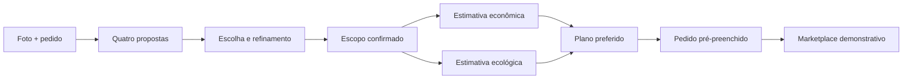

# Obra Clara

> **Obra Clara transforma uma foto e a intenção de uma reforma em um plano preliminar comparável, pronto para ser levado a profissionais, sem fingir medição técnica nem contratação.**

Obra Clara é uma experiência guiada para quem está planejando reformar um ambiente. A pessoa visualiza alternativas, escolhe um caminho, confirma o escopo, compara duas formas de estimar o trabalho e prepara um pedido estruturado para avaliação profissional.

> **Atenção sobre o estado atual:** este README descreve o produto e os limites definidos no repositório. A árvore remota consultada ainda é documental. Leia o [QUALITY_GATES.md](./QUALITY_GATES.md) antes de tratar qualquer etapa como concluída.

## Estado atual

No snapshot remoto consultado em **19/08/2026**, `main` continha `PRD.md`, `PLANO_EXECUCAO_EQUIPE.md`, `QUALITY_GATES.md` e este README. As branches `artur`, `fabio` e `joao` também existiam, mas apontavam para uma árvore sem código de aplicação.

Nenhuma árvore consultada apresentava `src/`, `package.json`, lockfile, `.env.example`, migrações do Supabase, configuração da Vercel, build log ou URL pública do produto. Portanto:

- não há runtime da aplicação comprovado neste snapshot;
- não há integração Supabase, OpenAI ou Vercel comprovada;
- o fluxo abaixo é o produto especificado, não uma promessa de que já está funcionando;
- não há comandos locais publicados porque não existe um manifesto de pacote ou configuração executável para sustentá-los.

A documentação de referência é o [PRD](./PRD.md), o plano de execução é o [PLANO_EXECUCAO_EQUIPE.md](./PLANO_EXECUCAO_EQUIPE.md) e os critérios obrigatórios de evidência estão no [QUALITY_GATES.md](./QUALITY_GATES.md).

## A jornada do produto

A história é uma só, do primeiro registro visual até um pedido que um profissional pode avaliar:



### 1. Registrar o ambiente

A pessoa envia uma foto de um cômodo e informa cidade e UF, tipo de ambiente, área aproximada, nível de acabamento e o que deseja mudar. A foto serve como referência visual. O produto não mede o cômodo a partir de pixels.

### 2. Explorar quatro caminhos

A aplicação gera quatro propostas visuais para o mesmo ambiente. A pessoa compara as opções e escolhe uma. O objetivo é dar controle sobre a direção da reforma, não apresentar uma decisão automática.

### 3. Refinar uma escolha

A proposta escolhida vira a origem de um ajuste focado, como preservar o piso, mudar a iluminação ou reduzir o número de alterações. O PRD prevê uma rodada visível de refinamento no P0.

### 4. Confirmar o escopo

O sistema faz no máximo três perguntas objetivas quando uma resposta muda a estimativa. A pessoa revisa categorias, quantidades, unidades e premissas antes de confirmar o escopo.

### 5. Comparar duas estimativas preliminares

A mesma base de escopo alimenta dois perfis:

- **Mais econômica:** prioriza o menor investimento inicial razoável.
- **Mais ecológica:** aplica alternativas catalogadas que podem favorecer reuso, menor descarte, eficiência ou materiais de menor impacto potencial.

A comparação deve mostrar faixa de valor, diferenças por item, premissas e ressalvas. A alternativa ecológica não é uma obrigação moral nem recebe um índice ambiental inventado.

### 6. Preparar o pedido para profissionais

O pedido é pré-preenchido com a imagem escolhida, cidade e UF, área aproximada, escopo, faixa da estimativa, preferência de plano e prazo. A pessoa revisa o conteúdo e autoriza a exibição no protótipo.

A etapa final é um **marketplace demonstrativo**. Os perfis e propostas são fictícios, devem carregar a marca `Perfil demonstrativo` e não representam profissionais disponíveis.

## Roteiro da Rodada 1

O [QUALITY_GATES.md](./QUALITY_GATES.md) define uma apresentação de aproximadamente três minutos, seguida de perguntas. O roteiro abaixo é o plano de demo do PRD. Ele só pode ser apresentado como fluxo funcional depois que cada etapa tiver evidência observável.

| Tempo | História | O que precisa estar comprovado |
| --- | --- | --- |
| 0:00 a 0:20 | O problema: a intenção da reforma começa visual, mas chega ao profissional sem escopo e sem noção clara de custo. | Narrativa do produto. |
| 0:20 a 0:40 | Carregar o ambiente de exemplo e informar pedido, cidade, área e tipo de cômodo. Iniciar quatro propostas. | Entrada, upload e geração real ou fallback explicitamente rotulado. |
| 0:40 a 1:15 | Enquanto a geração acontece, explicar que a pessoa escolhe, que a imagem não mede o ambiente e que os valores são preliminares. | Estados de espera e limites do produto. |
| 1:15 a 1:50 | Comparar quatro opções, escolher uma e mostrar o refinamento a partir da escolha. | Seleção e linhagem da rodada de refinamento. |
| 1:50 a 2:30 | Responder até três perguntas, confirmar escopo e comparar os dois perfis. Abrir uma diferença ecológica. | Perguntas, escopo, cálculo e ressalvas. |
| 2:30 a 2:55 | Escolher receber propostas para os dois perfis, revisar o pedido e publicar no marketplace demonstrativo. | Consentimento, pedido pré-preenchido e estado de publicação. |
| 2:55 a 3:00 | Fechar: uma foto virou uma escolha, um plano transparente e um pedido que um profissional pode avaliar. | Encerramento sem sugerir contratação real. |

Cortes de tempo, dados semeados e perfis fictícios devem ser identificados durante a apresentação. Esperar que a narrativa complete uma tela que não funciona não é evidência de versão funcional.

## Implementado, demonstrativo e planejado

A documentação e a aplicação não são a mesma coisa. Esta é a fronteira que o README mantém explícita:

| Faixa | O que significa aqui |
| --- | --- |
| **Implementado e comprovado** | Neste snapshot, apenas a documentação do produto, o plano da equipe, os gates de qualidade e as referências Git remotas estão presentes. Não há código de aplicação ou execução comprovada. |
| **Demonstrativo por definição** | O marketplace do hackathon é uma interface de demonstração. Seus cards, perfis e propostas são fictícios e não oferecem matching real, contato, contratação, pagamentos, avaliações ou notificações. |
| **Planejado, ainda não comprovado** | A jornada completa da foto ao pedido, geração com OpenAI, persistência no Supabase, cálculo das duas estimativas, testes, deploy na Vercel e qualquer URL pública. Esses itens aparecem no PRD como objetivo técnico, não como evidência de entrega. |

Não há profissionais reais conectados ao produto. Publicar um pedido no protótipo não envia uma solicitação para ninguém.

## Arquitetura prevista

A arquitetura abaixo vem do PRD e ainda não deve ser lida como configuração existente:

| Camada | Escolha prevista | Situação comprovada no remoto |
| --- | --- | --- |
| Aplicação | Next.js App Router + TypeScript | Não comprovada. Não há `src/` nem `package.json`. |
| Interface | Tailwind e um conjunto pequeno de primitivas no estilo Radix/shadcn | Não comprovada. |
| Validação | Zod | Não comprovada. |
| Imagens | OpenAI Images Edit API | Integração prevista, não configurada ou testada no repositório consultado. |
| Escopo estruturado | OpenAI Responses API Structured Outputs | Integração prevista, não configurada ou testada no repositório consultado. |
| Dados | Supabase Postgres | **Alvo de dados previsto no PRD.** Não há migrações, URL de projeto ou configuração publicada. |
| Mídia | Supabase Storage privado, com URLs assinadas | **Alvo de mídia previsto no PRD.** Não há bucket ou fluxo de upload comprovado. |
| Hospedagem | Funções Node.js na Vercel | **Alvo de deploy previsto no PRD.** Não há configuração nem URL pública de aplicação comprovada. |
| Testes | Vitest, Testing Library e um smoke test Playwright se houver tempo | Não há testes ou configuração de testes no remoto consultado. |

O fluxo técnico planejado é: navegador cria uma sessão anônima, envia a foto por caminho assinado, o servidor chama os provedores de IA, guarda mídia privada e linhagem no Supabase, calcula as duas estimativas com regras determinísticas e persiste o pedido demonstrativo.

## Variáveis de ambiente previstas

O PRD define os nomes abaixo para a implementação planejada. Os valores não pertencem ao README. Como não existe `.env.example` ou configuração de aplicação no snapshot consultado, esta lista não significa que as variáveis já estejam sendo lidas.

```text
OPENAI_API_KEY
OPENAI_IMAGE_MODEL
OPENAI_SCOPE_MODEL
OPENAI_IMAGE_QUALITY
OPENAI_IMAGE_FORMAT
OPENAI_IMAGE_COMPRESSION

NEXT_PUBLIC_SUPABASE_URL
NEXT_PUBLIC_SUPABASE_PUBLISHABLE_KEY
SUPABASE_SERVICE_ROLE_KEY

SESSION_SIGNING_SECRET
MAX_GENERATIONS_PER_PROJECT
GENERATION_ENABLED
MARKETPLACE_MODE
```

Chaves da OpenAI, chave de serviço do Supabase e segredo de assinatura devem permanecer no servidor. Nenhum valor secreto deve ser colocado neste arquivo ou no bundle do navegador.

## Setup local

Não há setup local executável sustentado pelo repositório neste momento. A árvore remota não contém manifesto de dependências, lockfile, código de aplicação, `.env.example`, migrações ou scripts. Por isso, este README não inventa comandos como `npm install`, `npm run dev`, `npm test` ou `npm run build`.

Quando houver uma versão executável, os comandos publicados aqui deverão corresponder aos scripts reais do manifesto e passar pelos gates de qualidade. Até lá, o repositório público é a fonte da documentação, não uma aplicação local comprovadamente inicializável.

## Privacidade e segurança

As regras previstas no PRD são simples e importantes:

- imagens devem ficar em armazenamento privado e ser acessadas por URLs assinadas;
- o upload deve ser gerado pelo servidor e a imagem deve ser reencodada para remover EXIF e GPS;
- o endereço exato nunca aparece no pedido público, apenas cidade e UF;
- a exibição de imagens no marketplace demonstrativo depende de consentimento;
- os perfis e propostas de profissionais são fictícios e identificados;
- chaves, cookies, URLs assinadas e bytes de imagem não devem entrar em logs;
- pedidos sobre estrutura, hidráulica, elétrica, gás ou normas exigem revisão profissional;
- a retenção alvo para mídia anônima é de 24 horas, com limpeza documentada caso a automação não exista.

Essas são regras de projeto. Neste snapshot, elas ainda não foram validadas por uma aplicação em execução.

## Limites das estimativas

O resultado correto se chama **Estimativa preliminar**:

> Estimativa preliminar para planejamento. Não substitui medição, vistoria técnica ou orçamento executivo de um profissional.

Uma foto não revela dimensões exatas, condições do substrato, restrições estruturais, acesso, licenças ou sistemas ocultos. O produto não aprova projeto arquitetônico, estrutural, elétrico, hidráulico ou legal e não produz orçamento vinculante.

A estimativa planejada usa faixas, premissas, referências de custo e diferenças de materiais ou métodos. Nenhum preço deve vir diretamente do modelo. As alternativas ecológicas devem usar catálogo curado, explicar trade-offs e manter linguagem qualitativa. O MVP não promete redução específica de carbono, energia ou água, certificação, payback ou resultado ambiental universal.

## Repositório e ownership

- Repositório público: [github.com/juboyy/obria](https://github.com/juboyy/obria)
- Branch de integração: `main`, sujeita ao [QUALITY_GATES.md](./QUALITY_GATES.md) antes de release ou deploy.
- Branches de trabalho observadas: `artur`, `fabio` e `joao`.

O plano de execução associa as frentes de trabalho assim. Isso descreve ownership operacional; não é uma declaração de permissões ou proteção configurada no GitHub.

| Branch | Frente no plano | Responsabilidade resumida |
| --- | --- | --- |
| `joao` | Plataforma, IA e busca | Contratos técnicos, APIs, mídia, Supabase, geração, perguntas, estimativas e ranking. |
| `artur` | Produto, experiência e integração | Happy path, UX/UI, integração, README, demo, submissão e deploy planejado. |
| `fabio` | Marketplace demonstrativo e qualidade | Interface do marketplace, dados fictícios, revisão de estados e suporte à demo. |
| `main` | Integração e release | Receber mudanças avaliadas e evidências conforme os gates. |

## Referências do projeto

- [PRD](./PRD.md): requisitos, limites, arquitetura prevista e roteiro de demo.
- [Plano de execução da equipe](./PLANO_EXECUCAO_EQUIPE.md): responsabilidades, ordem de integração e ownership.
- [QUALITY_GATES.md](./QUALITY_GATES.md): critérios obrigatórios para apresentação, release e deploy.
